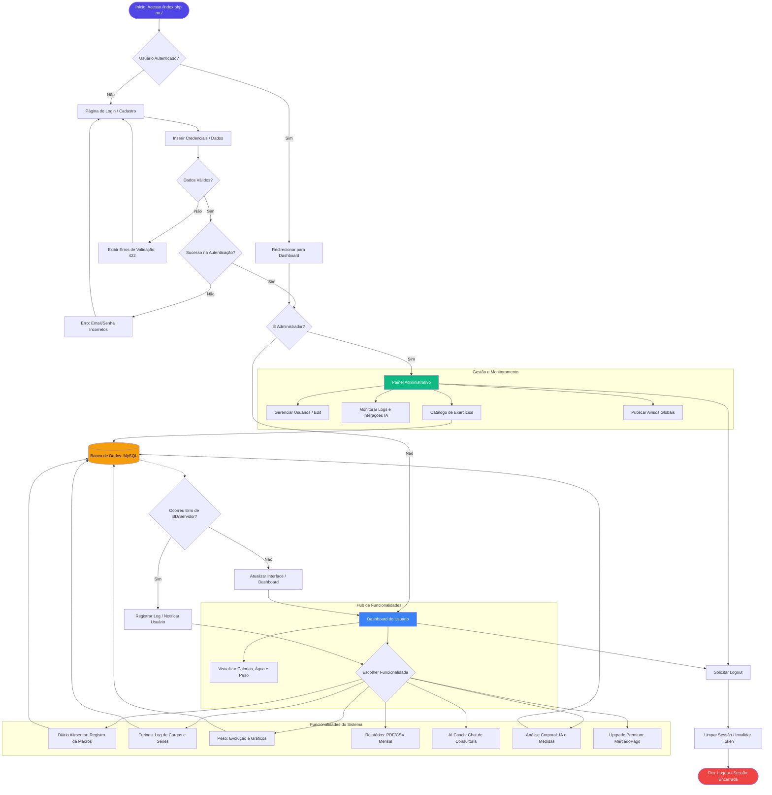

# Fluxograma do Sistema - Projeto Academia

Este documento apresenta o fluxo completo do sistema, desde o ponto de entrada do usuário até as funcionalidades principais e o encerramento da sessão. O objetivo é fornecer uma visão clara tanto para desenvolvedores quanto para gestores sobre como os dados e as interações fluem no ecossistema da aplicação (Laravel + PHP Legado).

## Fluxo de Processo (Mermaid)

## Legenda dos Símbolos

| Símbolo | Descrição | Uso no Sistema |
| :--- | :--- | :--- |
| **Oval (Início/Fim)** | Pontos de entrada e saída. | Acesso inicial e Logout. |
| **Retângulo** | Processo ou operação. | Registro de alimentos, cálculos de macros, edição de perfil. |
| **Losango** | Decisão ou bifurcação. | Validação de credenciais, checagem de nível (Admin vs User). |
| **Cilindro** | Banco de Dados. | MySQL (Tabelas de usuários, logs, diário, exercícios). |
| **Linha Contínua** | Fluxo principal de execução. | Sequência normal de navegação. |
| **Linha Tracejada** | Fluxo de erro ou processo secundário. | Tratamento de exceções e logs. |

## Resumo das Etapas Críticas

1.  **Validação de Dados:** O sistema utiliza `Laravel FormRequests` e validação em linha para garantir a integridade antes de qualquer inserção no banco de dados.
2.  **Tratamento de Erros:** Implementado via middlewares e blocos `try-catch`, redirecionando usuários para páginas de erro amigáveis em caso de falha no servidor (500) ou permissão negada (403).
3.  **Segurança:** Acesso protegido por `Middleware:auth`, garantindo que funcionalidades sensíveis não sejam expostas a usuários anônimos.
4.  **Encerramento:** O logout invalida a sessão PHP e regenera o token CSRF para prevenir ataques de fixação de sessão.
