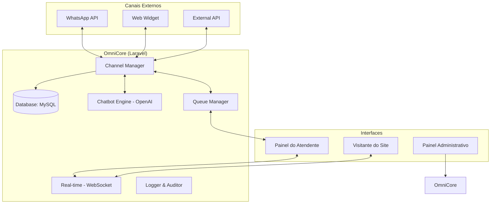

# Plano de Implementação: Chatbox Omnichannel Premium

Este documento descreve a arquitetura, o banco de dados e o fluxo de trabalho para o novo sistema **Omnichannel Chatbox**.

## 1. Arquitetura do Sistema

O sistema será construído sobre o **Laravel 11** com um frontend em **React (Vite)**. A comunicação em tempo real será gerenciada via **WebSockets (Laravel Reverb)**.

### Diagrama de Fluxo

## 2. Estrutura de Banco de Dados

### Tabelas Principais (Prefixo `omni_`)

| Tabela | Função |
|--------|---------|
| `omni_companies` | Gestão de multi-tenancy (empresas). |
| `omni_channels` | Configurações de WhatsApp, Widgets e APIs. |
| `omni_agents` | Atendentes vinculados às empresas. |
| `omni_queues` | Filas de atendimento (Suporte, Vendas, etc). |
| `omni_conversations` | Sessões ativas e históricas de chat. |
| `omni_messages` | Registro individual de mensagens. |
| `omni_chatbot_rules` | Regras de automação e IA. |
| `omni_business_hours` | Horários de atendimento por empresa. |
| `omni_logs` | Registro de auditoria e erros técnicos. |

## 3. Funcionalidades Detalhadas

### 🤖 Chatbot & Automação
- **IA Generativa**: Integração com GPT-4o-mini para respostas contextuais.
- **Palavras-chave**: Respostas instantâneas para perguntas frequentes.
- **Horários**: Mensagens automáticas de "fora de expediente".

### 👨‍💼 Gestão de Atendimento
- **Painel em Tempo Real**: Visualização de todas as conversas ativas.
- **Transferência**: Mover conversas entre atendentes ou filas.
- **Status On/Off**: Controle de disponibilidade do atendente.

### 🌐 Widget Omnichannel
- Interface flutuante moderna com Glassmorphism.
- Suporte a envio de anexos.
- Notificações sonoras e visuais.

## 4. Próximos Passos

1. **Migrações**: Criar a estrutura física no MySQL.
2. **Models & Services**: Implementar a lógica de negócio no Laravel.
3. **API Endpoints**: Definir rotas de comunicação.
4. **Frontend Admin**: Implementar gestão de empresas e canais.
5. **Widget JS**: Criar o script de integração para sites.

> [!IMPORTANT]
> O sistema foi desenhado para ser totalmente escalável, permitindo a adição de novos canais (Instagram, Telegram) com mínimo esforço de arquitetura.
